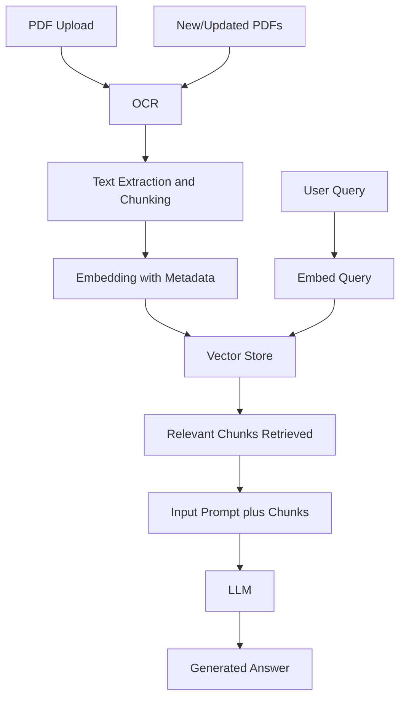

#  This file contain Answers to the Questions asked 

# Part 2 : Excersice 1


## RAG System design for company's PDF Document.


### Architecture Overview

The System comprises of the follwoing compoents:

1. Documents Processing:
2. Text chunking
3. Embedding text along with metadata
4. Storing into VectorDB 
5. Query -> Retrival
6. LLM Integration for Response genration
7. Knowledge update

#### 1. Documents Processing
- **Extraction** : Companies pdfs (contracts, policies) are uploaded and parsed, tools like `PyMuPDF` would be used for extraction of the unstructured data like tables, text and also metadata. If its native pdf (pictures taken) then an extra step of **OCR** would be used to extract information. for this purpose, `EasyOCR or DocumentAI` form google can be used, depending on the complexity of the documents.

- **Processing** : Preprocessing would be required at this stage, need to preserve hierarchy of the document structure like `sections`, `headings`, `header`, `footer`. Also need to remove unrequired symbols character etc.

- **Metadta** : We need to also add medata at this point, like document type (Policiy, contracts).

#### 2. Text chunking
- **Chunking**: Here text would be divinded into chunks mainting its hierarchy like by section or list or headings. 
- we can use `RecursiveCharacterTextSplitter` for this step (as i used in the demo exercise). 
- **Metadata** : Here we can also add metadata like `Chunk_id, section_title, Heading_level`.

#### 3. Embedding text
Each Chunk would be converted into Vector embeddings. Model like `all-MiniLM-L6-v2` or `BERT` can be used for this purpose. We have to see if general information required or category-based specific information needs to store in VecotrDB. 

#### 4. Storing into VectorDB 
For Large Production, `Qdrant` or `Weaviate` would be used to store the embeddings along with metadata to apply filtering overy extraction, Both they provide easily accessiblity to hybrid search and store metadata.

#### 5. Query -> Retrival
User will ask query: At this time, question must be embed using the **same embedding model**, for better retrival, and would be compared via similarity search like `cosine similarity` from vectorDB. The top-k relevants chunks would be passed as context to LLM for answer generation.

#### 6. LLM Integration for Response genration
As this application would be like chatbot, so chat-optimized LLM would be used like `GPT-4`, `Mistral` or `LLAMA 3.` We can provide a system instruction to model to as `zero-shot learning` which help the model to be provide relevant answer and must stick to the context. For generation of response the prompt would contain the question and the retrived chunks, which can be integrated using **LangChain or LLamaIndex**.

#### 7. Knowledge update
To update the Knowledge in the VecotrDb, As we will have all the information about the documents that was ingested, we can reprocess the updated documents through same **ingestion pipeline**, where VectorIDs and metadata will help to overwrite the information again. For this purpose we can use some hashing mechanism or simple can rely on the name of the document.

# Diagram:



## Question 1:
Answer: 
In **supervised learning**, the model learns from labeled data like teaching a model which email is spam or not, we train the model with the data having email already labeled with spam or not spam, where as in **Unsupervised learning**, the model find patterns in data without labels, the data is unlabeled. eg, group of customers behaviours. However, In **Reinforcement learning** , model learns by interacting with environment and it can be teached based on rewards or penalities. If model accurately made decision it get rewards otherwise penality.

## Question 2:
Answer:
Using AI in Business are very usefull and now its requiring. It has alot of benefits making task easier and fast for human. 
**Pros:**
Enhance Customer Experience.
Easy decision making from predictive prospective.
Automates the task.
Personalized chatbots.
Save time and cost.
**Cos:**
Need quality data otherwise not useful.
Privacy concern.
Data biasness cause inappropriate suggestion or response.
Models Answers are hard to interpret why it took that decision.


## Question 3:
Pseudo code:

``` bash
Load dataset (visits, conversions)

split into test and train

initialize model: LinearRegression()

train model: train(train visit, train conversion)

prediction: predict(test visit)

evaluate use MSE(prediction, test conversion)

```
## Question 4:
Answer:
1. Collection of data forexample, user clicks on the product, purchases and ratings given to product.
2. Hybrid model for recommendation (Content based and collaborative based.)
3. Training the model.
4. Evaluate
5. Deploy

## Question 5:
Answer:
1. Process data like, cleaning, label handling, train/test split.
2. Genereating vectors using BERT or similar.
3. Train the model Logistic regression.
4. Evaluating Accuracy, Precision, Recal, confusion matrix.
5. Deploy the model for prediction with company
Monitor the model.


## Question 6:
Answer:
RAG has more advantage over traditinal fine-tuning. **RAG** Allows you to directly fetch information from the source which makes it less pron to hallucinations, very much easier to update. It allows to dynamically retrives the relevant documents, where as **Fine tuning** is expensive, have static knowledge until and only have information over which it get trained. hard to maintain.

## Question 7:
Answer:
Though its sometime challenging to evaluate performance but still we can evaluate.
1. Prescision and recalls over retrived information.
Checking quality of answer by Exact match if GT is available. 
2. Use Human to evaluate.
3. User statisfaction through feedback.
4. nother Important Factor is to evaluate the response time and cost.
## Question 8:
Answer:
Yes hallucination occurs when model generates false information, it happens recently when i was working on problem. It can be mitigate through serveral techniques:
1. Provide more accurate context while reteriving information.
2. Using RAG which provide answer from database, more accurate.
3. Re-rank answers using validation.
