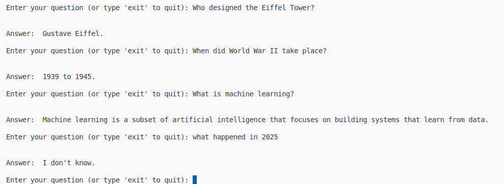

# RAG Application

## LangChain RAG App (with langchain-community)

## Features
- Loads plain text and chunks it
- Embeds using HuggingFace sentence-transformers
- Stores in FAISS vector DB
- Uses HugginFace to answer based on retrieved context

## Setup

- This application simply upload the `.txt` file. I have very basic file in data folder `text.tx`t which has simple three topics: `Python Programming`, `Machine Learning`, `The Eiffel Tower`, `Renewable Energy` and `World War II`. These only contains **some sentences** and does not have much details.

- If you want to upload new `.txt` file then upload into `data`folder and change the name from **run.py** file accordingly. It only accept txt files.
- After upload successfully it will ask you to type question and you will get answer, other wise it says i dont know ask relevant question. Example Question that might ask form **text.txt** data.

    - Who designed the Eiffel Tower?
    - When did World War II take place?
    - What is machine learning?
    - How many countries were involved in World War II?

At the end of the page you can see the results.


### Simple Run with Python:

Run simple `run.py` file with:
- Install requirements with:
``` python
pip install -r requirements.txt
```
Add **HF_TOKEN into .env** file and run the follwoing command.

```Python
python run.py
```s


### Run with Docker:

Build docker file with follwoing command:

```bash
docker build -t rag .
```
Then run the docker with follwoing command if you wan to add HuggingFace token inside docker command.

```bash
docker run -it -e HF_TOKEN=your_hf_token_value rag

```

## Results

